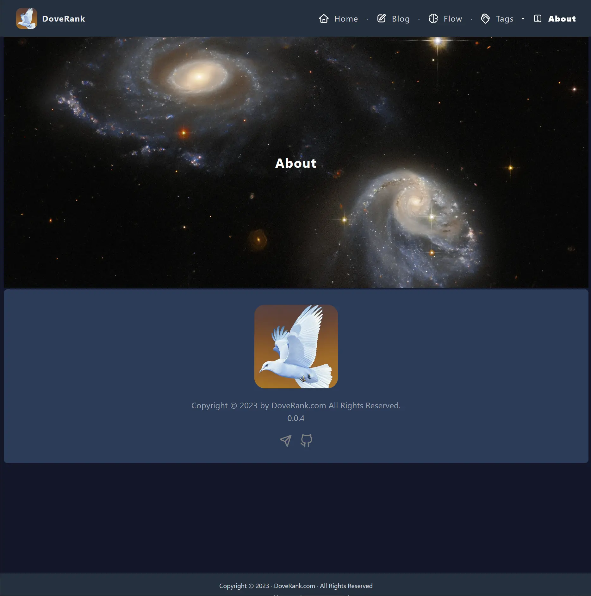

# next-blog

A lightweight blog site based on Next.js and Tailwind CSS.

## Features

### 1. Markdown to HTML

### 2. Tailwind CSS Integrated

### 3. PlantUML supported

### 4. Table of contents supported

## Installation

### 1. Install Node.js Software

https://nodejs.org

### 2. Install the project's dependencies

```shell
npm install
```

### 3. Startup the project

```shell
npm run dev
```

### 4. access URL in browser

http://localhost:3000

## Deploy

### 1. Build the project

```shell
npm run build
```

### 2. Deploy to server

Deploy the static files in `out` folder to your server.

## Preview



## Reference

Official Website: https://www.dovej.com
